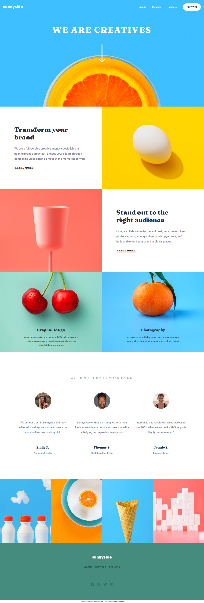

# Frontend Mentor - Sunnyside agency landing page solution

This is a solution to the [Sunnyside agency landing page challenge on Frontend Mentor](https://www.frontendmentor.io/challenges/sunnyside-agency-landing-page-7yVs3B6ef). Frontend Mentor challenges help you improve your coding skills by building realistic projects.

## Overview

### The challenge

Users should be able to:

-   View the optimal layout for the site depending on their device's screen size
-   See hover states for all interactive elements on the page

### Screenshot

### Links

-   Solution URL: [Sunyside agency](https://williamssam.github.io.sunnyside-agency-landing-page)
-   Live Site URL: [Sunyside agency](https://williamssam.github.io/sunnyside-agency-landing-page)

## My process

### Built with

-   Semantic HTML5 markup
-   CSS custom properties
-   Flexbox
-   CSS Grid

### What I learned

With this project, i made use of both flexbox and css grid to solidify my knowledge about them

### Continued development

Will continue to work more with css grid in the future

## Author

-   Twitter - [@williams_codes](https://www.twitter.com/williams_codes)
